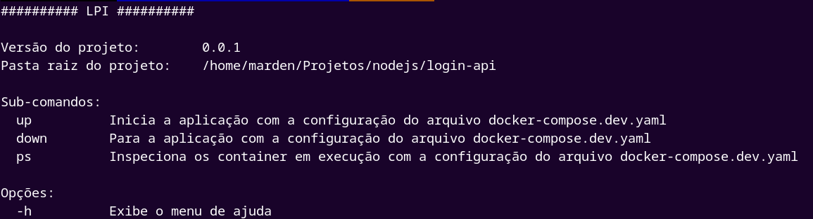

## Descrição

Projeto nest simples para estudo.

Essa api diponibiliza endpoints para login, para usuarios e healthckeck

## Instalação

```bash
$ npm install
```

## Executar app

Para executar o app na sua maquina de forma tradicional

```bash
# development
$ npm run start

# watch mode
$ npm run start:dev

# production mode
$ npm run start:prod
```

### Para executar o app com o docker

Antes de qualquer coisa, na pasta raiz do seu projeto execute esse comando

No linux

```bash
$ source ./bin/config.sh -d /caminho/para/raiz/do/projeto
```

se tudo acontecer com sucesso você devera ver a seguinte saida

```
$ Lpi configurado com sucesso
```

você pode testar executando o seguinte comando

```bash
$ lpi -h
```

com isso você devera ver o menu de ajuda do lpi


## Lpi

#### Acronimo para login-api.

Cli para ajudar no desenvolvimento do projeto com docker compose
